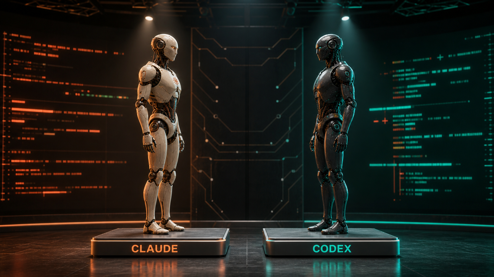

# sparring


> A cross-model review sparring loop — the author never grades its own work.

**Status: v0.4.0 — adds `/spar-weighin`, a plan-to-spar orchestrator that runs a checkbox plan through the loop task-by-task. The Claude-hosted loop includes safe skips, design-intent pointers, and a risk-triggered final sweep.**

Phases 1–4 are implemented; the core loop is verified end-to-end against real reviewers — a planted-bug task went FINDINGS → fix → blind re-review → CONVERGED. Today `/spar` gives you:

- an **enforced** review loop that iterates until the *reviewer* declares convergence;
- a **blind judge** that rules factual (`[MECHANICAL]`) stalemates;
- a **batched user gate + decision ledger** for genuine design choices;
- **cross-round matching** of re-worded findings;
- **single-agent mode** — auto-detects the reviewer (Codex if installed → cross-model, the recommended default; otherwise Claude), so `/spar` works with no second vendor. `--reviewer codex|claude` overrides;
- a reported **safe skip** for changes no larger than 10 lines / 2 paths when no risky path or unsafe change kind is touched;
- changed-surface **design-intent pointers** on every fresh review;
- a once-only, fresh Claude **final sweep** after risky, long, or design-bearing loops.

<br>




Phase 8 (the `/spar-weighin` orchestrator) ships in v0.4.0. Phases 5–7 (unattended mode, the Codex-hosted mirror, model economics) are design only — the [Roadmap](#roadmap) marks what exists today. A small [effect benchmark](bench/README.md) ships with this release.

## Direction

Coding agents are good at writing code and bad at noticing what they got wrong. Asking the same model to review its own output does not fix this: it is lenient toward its own work, and it shares the blind spots that produced the bug in the first place.

**sparring** pairs an *author* model with an *independent reviewer* model from a different vendor (Claude ↔ Codex), and turns review into an enforced, converging debate. Three ideas drive the design:

1. **Review is enforced, not requested.** A deterministic Stop hook blocks the author's exit until the loop completes. Prompt discipline is never trusted — if the harness can't guarantee it, it didn't happen.
2. **Only the reviewer can declare the work done.** The loop ends when the reviewer outputs `STATUS: CONVERGED` — the author has no way to grade its own work as finished. Self-assessment bias is removed structurally, not by exhortation.
3. **Debate, with guardrails against persuasion.** Findings split into `[MECHANICAL]` (fixed on sight) and `[DESIGN]` (a choice among valid alternatives). Design findings don't interrupt the loop — the author states a position, and the reviewer accepts or contests it the next round. Only a genuine stalemate escalates: a **blind judge** (sees the code and the finding, never the debate) settles factual disputes; a single batched question to the human settles real design choices. Convergence comes from evidence, not from whoever argues more confidently.

sparring is inspired by [hamelsmu/claude-review-loop](https://github.com/hamelsmu/claude-review-loop), which pioneered the Stop-hook-enforced Codex review. Several loop-hardening ideas — the fixed review baseline, the conveyance boundary (never tell the reviewer what was "fixed"), the decision ledger, design-intent harvesting, and tiered fix writers — are adapted from the review-loop protocol in [jongwony/epistemic-protocols](https://github.com/jongwony/epistemic-protocols). sparring keeps hamelsmu's skeleton and extends it where a single-pass review falls short:

| | review-loop (origin) | sparring | Status |
|---|---|---|---|
| Review rounds | one | until the reviewer converges (capped) | ✅ Phase 1 |
| Reviewer input | diff only | diff **+ the task requirements** | ✅ Phase 1 |
| Fix verification | none (fixes are never re-reviewed) | every round re-reviews the previous round's fixes | ✅ Phase 1 |
| Author accountability | "use your own judgment" | per-finding response file (`FIXED` / `REJECTED` + grounded reason), enforced by the hook | ✅ Phase 1 |
| Finding triage | severity only | `[MECHANICAL]` auto-fix / `[DESIGN]` debate-first → gate | ✅ Phase 2 |
| Disagreement | author decides | 2-round stalemate → blind judge (factual) or batched user gate (design) | ✅ Phase 2 |
| Cross-round identity | (n/a) | re-worded findings matched to the canonical one | ✅ Phase 2 |
| Reviewer sandbox | full bypass | `--sandbox read-only` | ✅ Phase 1 |
| Trivial change handling | always review | reported size + kind safe skip | ✅ Phase 4 |
| Project intent | reviewer rediscovers it | changed-surface rule / rationale / comment pointers | ✅ Phase 4 |
| Closure check | none | risk-triggered fresh blind author-family sweep | ✅ Phase 4 |

## How it works

Everything below runs today, except the steps tagged `(planned Pn)`. `/spar-weighin` wraps `/spar` for multi-task plans, running each task through the loop independently.

```
/spar <task description>
      │
      ▼
[Implement]   the author writes the code, then tries to stop
      │
      ▼
 Stop hook ─── small AND safe kind? ──▶ reported skipped exit
      │
      ▼
[Round N]     reviewer (read-only sandbox) reviews diff + requirements
      │        re-worded repeats are matched to the canonical finding
      ├─ STATUS: FINDINGS
      │    ├─ [MECHANICAL] → author fixes immediately, no questions asked
      │    ├─ [DESIGN]     → debate-first; parked, then batched at the gate
      │    ├─ stalemate (2 rounds on the same finding)
      │    │    ├─ factual → blind judge (code + finding, never the
      │    │    │            debate); UPHELD / DISMISSED is binding
      │    │    └─ design  → batched user gate + decision ledger at loop end
      │    └─ author writes a per-finding response → round N+1 (cap: 5)
      │
      └─ STATUS: CONVERGED
              ├─ risky repo/path · 3+ rounds · design finding?
              │    → final sweep: fresh blind Claude subagent
              │      re-verifies diff + requirements → clean ? exit : round N+1
              ├─ otherwise → exit
              └─ detailed final report                            (planned P5)
```

The reviewer / judge / matcher run as **Codex** (`codex exec --sandbox read-only`, the default cross-model setup) or **Claude** (`claude -p`, read-only + isolated — single-agent mode); the protocol and invariants are identical either way.

The same structure runs in both directions. The seats swap; the invariants don't:

| Seat | Claude-hosted (`/spar`) | Codex-hosted (planned) |
|---|---|---|
| Author (sole writer) | Claude Code session | Codex CLI session |
| Reviewer (declares `CONVERGED`) | `codex exec --sandbox read-only` (default) or `claude -p` (single-agent) | `claude -p` (read-only tools) |
| Enforcement | Stop hook blocks exit | git pre-commit hook blocks commit (gates landing, not session exit) |

## Invariants

1. **Single-writer** — only the author edits code. The reviewer runs in a read-only sandbox.
2. **Reviewer-declares** — the author never writes the convergence marker. Ever.
3. **Deterministic enforcement** — hooks gate exit/commit; instructions alone are never the safety mechanism. Hooks fail *open* (a broken hook must not trap the user).
4. **Blind adjudication** — judges and sweepers never see the debate, only the artifact and the requirements.

## Roadmap

| Phase | Scope | Status |
|---|---|---|
| 1 | Core loop: `/spar`, Stop hook, round machinery, per-finding response enforcement, round cap, read-only reviewer | ✅ done |
| 2 | `[DESIGN]` debate-first (conveyance boundary + decision ledger) · stalemate blind judge · batched end-of-loop gate · cross-round semantic finding matcher | ✅ done |
| 3 | Single-agent mode: same-family sparring (Claude reviewer/judge/matcher) so `/spar` works without Codex — auto-detect + explicit override; cross-model stays the default | ✅ done |
| 4 | Safe skip + changed-surface intent harvest + risk-triggered final sweep + durable exit reason | ✅ done |
| 5 | Unattended mode + final report | planned |
| 6 | Codex-hosted adapter (mirror seats, git pre-commit enforcement) | planned |
| 7 | Model economics: reviewer model + effort config, tiered fix writers (judgment stays on the session model; a cheaper tier types the fixes) | planned |
| 8 | `/spar-weighin` orchestrator: writing-plans → dedicated branch → per-task (or `--whole`) spar loop, single Stop-hook dispatcher wrapping the loop hook, per-task checkbox commits | ✅ done |

## Install

```bash
claude plugin marketplace add wnjoon/sparring
claude plugin install spar@sparring
```

Requires `jq`. The [Codex CLI](https://github.com/openai/codex) (`npm install -g @openai/codex`) is **recommended** — with it, `/spar` runs cross-model (Claude author ↔ Codex reviewer). Without it, single-agent mode reviews with Claude alone. Force a family with `/spar --reviewer codex|claude -- <task>`.

`/spar` starts only from a clean worktree by default. `--include-dirty`
explicitly adopts the entire pre-existing dirty surface and disables automatic
skip.

## Repository layout

```
plugins/spar/            Claude Code plugin (commands, Stop hook)
  commands/              /spar, /spar-cancel, setup guards + surface helpers
  shared/policy.md       loop policy — source of truth for both adapters
  shared/prompts/        reviewer / judge / matcher / sweeper templates
docs/superpowers/        specs, plans, and design-decisions per phase
tests/                   pure-bash hook + resolver tests
bench/                   effect benchmark (living report + tasks/oracles)
```

## Development

- `main` — releases only. `dev` — integration. `task/<n>-<name>` — one branch per plan task, merged into `dev`.
- The plan is the spec: [docs/superpowers/plans/](docs/superpowers/plans/). This README is updated in the same change whenever implementation diverges from it.
- Decisions agreed for phases not yet implemented live in [docs/design-decisions.md](docs/design-decisions.md) — each phase's plan document starts from its section there.

## License

MIT
